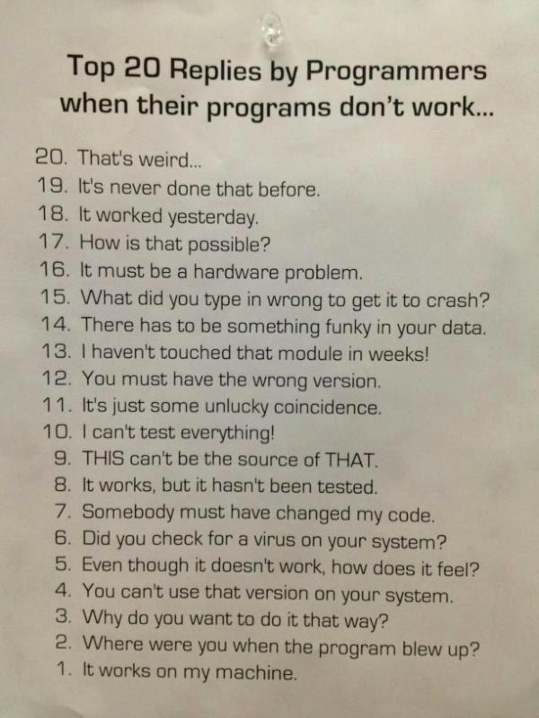

# 피플웨어(People Ware)를 읽고

피플웨어는 소프트웨어 개발 프로젝트 관리, 조직 관리에 관한 몇 개의 짧은 논문들을 엮은 책이다. 책의 내용으로 봤을 때, 피플웨어라는 단어는 사람을 뜻하는 People과  소프트웨어(Soft Ware) 에서 웨어(Ware)를 가져와서 만든 단어인 듯 하다.

문득, 소프트웨어라는 단어는 어떤 의미의 복합어인지 궁금해서 찾아봤으나 정확한 유래를 찾기 어려웠다. 사전에서 Ware는 '언급 된 재료나 방식으로 또는 언급된 곳에서 만들어진 제품들을 가르킨다'는 의미인데, 앞에 Soft / Hard 구분은 단지 컴퓨터라는 대분류 아래에서 유형이냐 무형이냐로 나누어진건지 궁금하다.

> 업무에서 발생하는 문제들은 대부분 기본적으로 기술의 문제가 아니라 조직사회학의 문제다. 
>
> -피플웨어. 톰 디마르코, 티모시 리스터 저.  박승범 역.  매일경제신문사  2003. 19페이지

비용이나 시간, 여러가지 복합적으로 고려해야 할 사항들이 있긴 하지만 어떤 기술적인 문제에 부딪혔을 때 결국은 그것을 극복해내게 되는 것 같다. 또한, 적어도 내가 근무하는 환경에서 클라이언트의 상식적인 선의 요구사항이라면 구현 해내는데 있어서 '불가능은 없다'이기 때문에 위의 문구가 참 와닿았다.

## 관리자의 역할

> - 기계(인간 기계) 를 최대한 원활히 가동시켜 오동작을 일으키지 않도록 하라.
>
> - 근무 시간에 게으름을 피우는 사람들을 봐주지 말라.
>
> - 직원들을 호환 가능한 기계 부품으로 생각하라.
>
> - 작업 늉률을 항상 비슷한 수준으로 유지하라.
>
> - 프로세스를 표준화하라. 메뉴얼에 적힌 대로 하라.
>
> - 실험적인 시도는 하지 말라. 그것은 본사 경영진들이 할 일이다.
>
>   ​
>
>   위와 같은 관리기법은 패스트푸드 사업(아니면 다른 생산 관련 분야) 관리자에게는 맞겠지만, 그렇지 않은 사람들에게는 사정이 다르다. 만들어서 팔기만 하면 된다는 식의 '햄버거 마인드'는 개발 분야에서 치명적인 결과를 야기할 수 있다. 
>
>   -피플웨어. 톰 디마르코, 티모시 리스터 저.  박승범 역.  매일경제신문사  2003. 23페이지
>
>   ​
>
>   관리자가 진정 해야 하는 일은 사람들에게 일을 시키는 것이 아니라 그들이 일에 전념할 수 있는 환경을 만들어 주는 것이다. 
>
>   -피플웨어. 톰 디마르코, 티모시 리스터 저.  박승범 역.  매일경제신문사  2003. 65페이지
>
>   ​
>
>   최고의 관리자는 팀원들이 '관리되고 있다'라는 느낌을 받지 못하는 가운데 끊임없이 이런 기회들을 제공하는 사람이다. 
>
>   -피플웨어. 톰 디마르코, 티모시 리스터 저.  박승범 역.  매일경제신문사  2003. 225페이지

## 소프트웨어 품질

> 관리자들은 품질을 시장의 요구에 따라 다양하게 바꾸어 공급할 수 있는 것처럼 생각하는 경향이 있다. (중략) 반면 품질에 대한 프로그램 설계자들의 견해는 매우 다르다. 자존심이 품질에 연결되어 있기 때문에, 그들은 자신의 품질 기준을 제품에 적용한다. 
>
> -피플웨어. 톰 디마르코, 티모시 리스터 저.  박승범 역.  매일경제신문사  2003. 43페이지
>
> 
>
> 아직 불완전한 제품을 '그만하면 됐다' 라고 판단하는 것은 팀 단결에 사형 선고를 내리는 것과 다름없다. 싸구려 제품을 만드는 일에서 얻어지는 공동의 만족감으로는 직원들을 결속시킬 수가 없을 것이다. '오직 완벽한 제품에만 우리는 만족한다'라는 정반대의 태도는 팀으로 하여금 실력을 발휘할 기회를 주는 것이다.
>
> -피플웨어. 톰 디마르코, 티모시 리스터 저.  박승범 역.  매일경제신문사  2003. 239페이지

그렇다. 소프트웨어 품질은 개발자의 자존심이다. 아래는 개발자가 가장 많이 하는 20개 변명이라는 유머 글인데 피식하며 공감하면서도, 공감한다는 것에 부끄러워진다.

http://www.ohgizmo.com/2014/04/17/common-replies-programmers-code-doesnt-work/

## 조직

> 최고의 조직은 다양한 종류가 있다. 그런 회사들은 서로 동일한 점보다는 다양성이 있기 때문에 주목할 만 하다. 하지만, 그들의 공통점은 최고에 대한 집착이다. 그것은 복도에서나 회의실에서나, 그리고 심지어 자유 토론에서도 항상 대화의 주제가 된다. 이것은 반대의 경우에도 마찬가지이다. 최고가 아닌 조직에서는 이러한 주제가 거의 또는 결코 논의되지 않는다. 
>
> -피플웨어. 톰 디마르코, 티모시 리스터 저.  박승범 역.  매일경제신문사  2003. 175페이지
>
> 
>
> 대부분의 회사들을 살펴볼 때 가장 화나는 점은 회사들이 단지 고용된 사람들의 집단에 불과하다는 것이다.
>
>  -피플웨어. 톰 디마르코, 티모시 리스터 저.  박승범 역.  매일경제신문사  2003. 181페이지

단지 피고용인이 되어 월급을 받고 월급을 받는 만큼 일하고. 이런 방식의 삶은 내가 추구하는 삶과는 다른 방식이다. 끊임 없이 배우고, 끊임 없이 갈망하며 즐겁게 개발하고 싶다. 완벽한 소프트웨어는 세상에 절대 있을 수 없다는 말을 어디선가 본 것 같다. 하지만 그것을 추구하는 과정 역시 굉장히 중요하다고 생각한다.