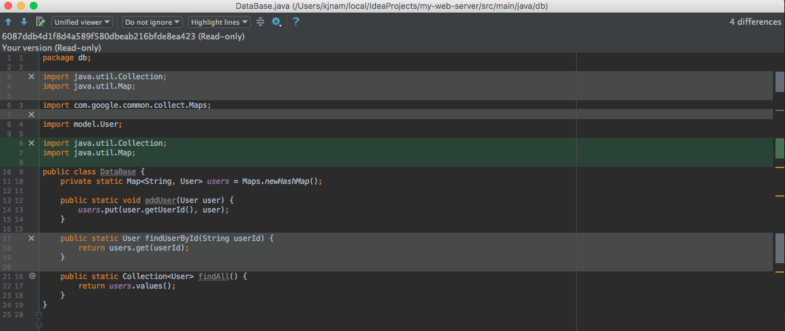
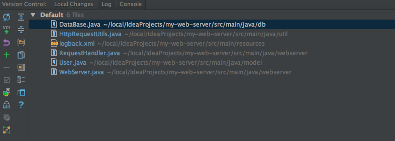
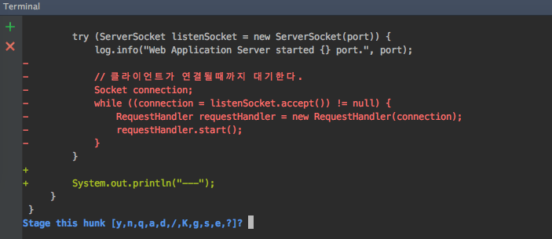

# GIT 더 꼼꼼하게 커밋하기

생각해보면 코드(Code)를 다루는 작업은 `fetch`로 시작해서 `commit`으로 끝난다. 버전관리시스템을 통해서 여러명의 팀원들이 협업을 한다면 아침에 출근해서 원격저장소와 소스코드의 버전을 맞추고 작업을 진행한다. 그리고 내 작업량을 모두 해치우고 커밋을 하고 나서야 한숨 돌릴 수 있다.

> (Git에서는 로컬 저장소에 소스코드를 올리는 일을 `Commit`, 받는 일을 `Fetch` 라고 하고 원격 저장소에 올리는 일은 `Push` 받는 일은 `Pull` 라고 하지만, 편의상 이 글에서는 `Commit` 과 `Fetch` 라는 용어만 사용한다.)


커밋이라는 행위는 내 코드, 내가 작성한 코드가 나만의 통제를 벗어나는 것이다. 그래서 나는 커밋 전에는 가능한 꼼꼼하게 다시 한번 보려고 노력한다. 내 코드를 내 스스로 다시 한번 리뷰하는 것이다. 통합개발도구(IDE)에서는 현재 원격저장소에 있는 해당코드와 내가 가지고 있는 코드의 차이(diff) 를 구분하기 쉽게 보여 준다.



여기서 한 가지 아쉬운 점은, 내가 변경한 소스들을 파일 단위로 하나 하나 그렇게 비교를 해봐야 한다는 것이다.  

만약 10개의 소스파일을 수정했다면 10개 파일을 클릭해서 열어봐서 비교해야 하고, 20개의 소스 파일을 수정 했다면 20개를 열어 봐야 하는 것이다. 굉장히 귀찮은 일이다.


## Patch Mode

```shell
$ git add -p
# 또는 
$ git add --patch
```

패치모드는 추척되고 있는 소스 중, 변경 된 모든 것을 추적하여 변경 된 덩어리(hunk) 단위로 돌아가며 보여준다.



글로는 잘 이해가 안갈텐데, 위와 같이 변경 된 (`+` 또는 `-`) 부분만을 보여주면서 모든 소스 파일들의 변화를 추적한다. 

직접 해보는 것이 좋은 방법이지만, 환경이 여의치 않다면 [Intro to git add patch mode tutorial](https://www.youtube.com/user/johnkarydotnet) 영상을 보면 패치모드가 어떤식으로 동작하는지 이해할 수 있을 것이다.

그리고 이렇게 보여주는 변경 변경 덩어리마다 어떻게 처리할 지를(스테이지에 올릴지, 그냥 넘어갈 것인지를) 선택해주면 된다.

```shell
Stage this hunk [y,n,q,a,d,/,j,J,g,s,e,?]?
```

위와 같이 선택지가 12개인데, 각각의 옵션들에 대한 설명은 [stackoverflow.com에 올라온 관련 글](http://stackoverflow.com/questions/1085162/commit-only-part-of-a-file-in-git)에서 확인할 수 있다.


## commit --verbose

패치모드를 통해 변경 된 코드 덩어리들을 빠르게 리뷰 할 수 있다. 그리고 이 과정에서 스테이징 할 소스코드 들을 선택했을 것이다. 이제 커밋을 할 차례. 하지만 마지막 산을 넘어야 한다.

```shell
$ git commit -v
# 또는
$ git commit --verbose
```

위와 같은 커맨드를 입력하면 편집기가 열리면서 커밋 메세지를 작성할 수 있고, 수정 된 코드들을 다시 한번 리뷰하고 편집기에서 바로 수정할 수 도 있다.


코드를 작성하거나 수정한 후 당연히 꼼꼼히 확인하겠지만 사람이다 보니 놓치는 부분이 있기 마련이다. 이를 방지하기 위해 두 번의 리뷰 과정을 다시 거치면서 마침내 코드를 커밋하게 되는 것이다. 조금 번거롭긴 하지만 좋은 습관이라 생각 된다. 나도 항상 이런 습관을 유지하도록 노력해야겠다.
