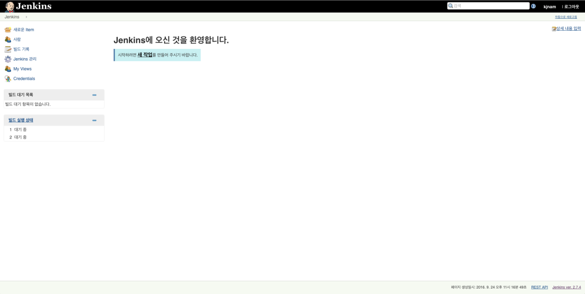
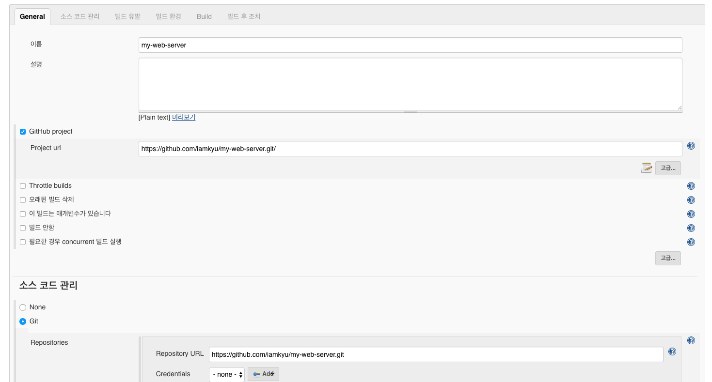
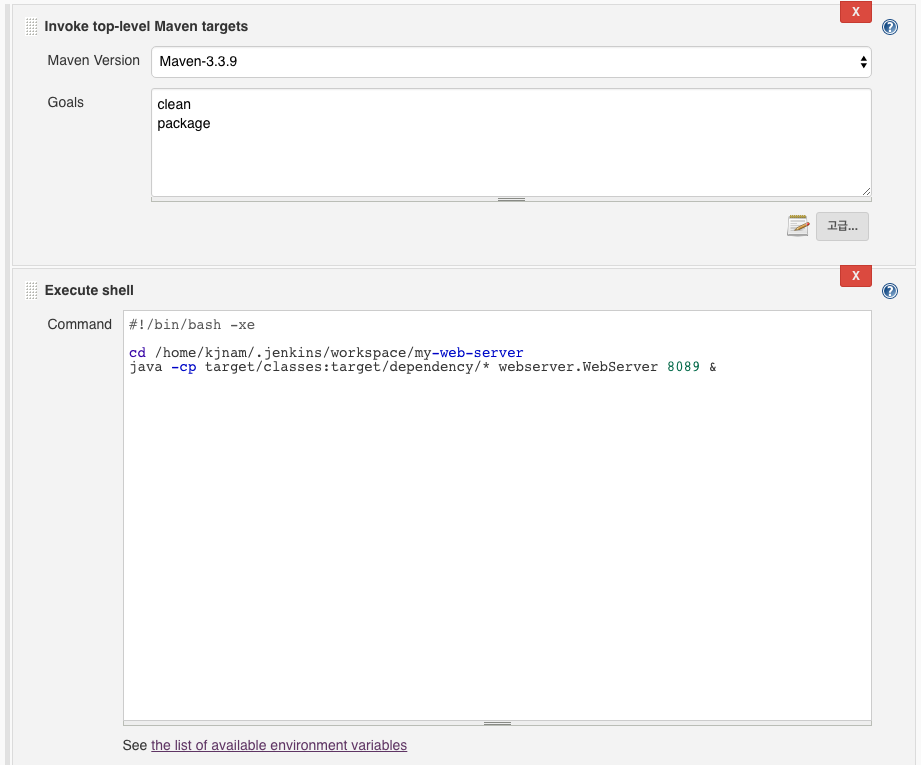
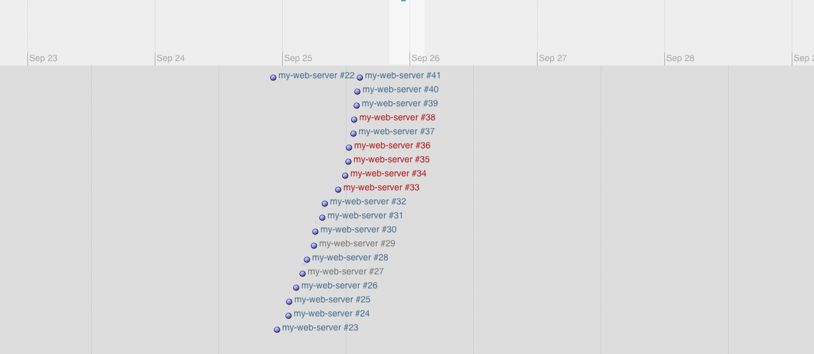

# Jenkins CI 삽질기

최근에는 [자바 웹 프로그래밍 Next Step 하나씩 벗겨가는 양파껍질 학습법(박재성 저. 로드북. 2016)](http://book.naver.com/bookdb/book_detail.nhn?bid=11037465) 책을 통해서 자바 웹 프로그래밍을 다시 기초부터 학습하고 있다. 이 책은 기존의 책들과는 학습 방식이 굉장히 다르다. 

책 시작이 웹서버에 터미널을 통해 애플리케이션을 배포하는 것 부터 시작해서 웹 서버를 직접 구현하고, 웹 애플리케이션을 만들고 점진적으로 개선해 나간다. 그리고 그 과정에서 모든 답을 주는 것이 아니라 힌트를 주고 학습자가 스스로 공부할 수 있게 해준다. 때문에 이 책을 학습하는 과정에서 HTTP에 관련 된 책도 봐야 하고 리눅스 명령어에 대해서도 찾아봐야 하고 자바도 공부해야 한다. 이 책에서 추가 학습을 권장하는 서적만 해도 20권 가까이 되는 것 같다. 굉장히 좋은 책이지만 쉽지 않다. 그래서 저자 분도 이 책의 대상 독자를 최소 1년 이상의 경험을 가진 자바 웹 개발자라고 얘기한다.


나도 이 책을 따라 간단한 웹 서버를 구현하고 놀고 있는 노트북에 우분투 서버 환경을 만들어 배포를 실습했다. 그 과정은 마크다운 형식의 문서로 정리했다.

- [우분투 서버 설정](https://github.com/iamkyu/TIL/blob/master/server-infra/ubuntu-server-setting.md)


그리고 이렇게 직접 서버를 구축하고 배포를 경험하는김에 C.I(Continuous integration) 환경 도 갖춰봐야 겠다는 생각을 했다.

- [젠킨스 홈페이지](https://jenkins.io/)



젠킨스는 한글화가 잘 되어 있었고, 빌드 도구(Maven, Gradle 등)와 함께라면 사실 딱히 어려울 것도 없었다. 다만 발목을 잡는 것은 익숙하지 않은 리눅스 명령어 들과 쉘 스크립트 작성이었고, 이 과정에서 굉장히 많은 삽집을 했다. 

내가 계획한 빌드 자동화 과정은 아래와 같다. (과정 중 Github에 커밋이 되면 자동으로 hook 하여 자동 빌드, 배포가 되도록 할 수 있는 플러그인이 있는데 아직 적용해보지는 않았다.)

> 코딩 > Github에 Commit > Jenkins에서 빌드(컴파일,테스트,패키징) 진행 > 배포(Deploy)

젠킨스에서는 아이템(item) 단위로 관리를 하는데 이 아이템은 프로젝트가 될 수도 있고 어떤 Job Process가 될 수도 있다. 



위 그림은 내가 배포할 MAVEN 프로젝트를 아이템으로 등록하고 설정하는 화면인데 한글을 거의 완벽하게 지원하기 때문에 별로 어려울게 없다. 아이템 설정에서 자바 버전, 메이븐 버전, 소스코드 저장소의 URL을 등록해주고, Build 를 위한 메이븐 골(Goal) 을 설정했다.


나는 나의 애플리케이션(간단한웹서버)를 exploded 방식 (.jar이나 .war 으로 압축한 것이 아닌 압축을 푼 디렉토리 형식으로 배포) 으로 배포하고 싶었는데, 그러러면 빌드를 완료한 후 쉘을 실행하도록 지정해야 했다. 그래서 나는 빌드 후 Execute shell을 실행하도록 설정하였다. 



위의 쉘 커맨드를 분석해보자면

```shell
#!/bin/bash -xe
# bash쉘로 쉘스크립트를 실행
# -xe 옵션은 쉘 스크립트 오류 시 젠킨스 빌드 실패처리 가능토록 처리 

# 소스 코드가 갱신되고 있는 디렉토리로 이동
cd /home/kjnam/.jenkins/workspace/my-web-server
# classes들과 dependency들을 의존하여 webserver 팩키지의 WebServer 클래스를 실행
# WebServer 클래스는 메인 클래스이고 매개변수로 전달하는 8089는 사용할 포트번호를 뜻함.
# 맨 끝의 & 는 해당 명령이 백그라운드 태스크로 진행하도록 설정
java -cp target/classes:target/dependency/* webserver.WebServer 8089 &
```

문제는 빌드는  계속 성공이 되는데, 배포가 되지 않았다.

 

원인을 계속 찾던 중

```shell
java -cp target/classes:target/dependency/* webserver.WebServer 8089 &
# 백그라운드 테스크로 실행하라는 & 명령을 제외
java -cp target/classes:target/dependency/* webserver.WebServer 8089
```

위 커맨드와 같이 &을 제외하니 배포가 정상적으로 되었다. 문제는 해당 애플리케이션은 무한 루프가 돌고 있는 프로그램이기 때문에 젠킨스 빌드 과정도 끝나지 않았고, 계속해서 빌드가 진행 중인 것으로 나타났다. 좀 더 정보를 찾던 중 원인을 찾았는데, 이유는 백그라운드테스크로 실행을 하더라도 젠킨스가 빌드를 완료하면서 해당 프로세스를 같이 죽여(kill) 버리는 것이 었다.

- 참고:  [Stackoverflow-Clean way of launching a shell script in background from Jenkins](http://stackoverflow.com/questions/37160402/clean-way-of-launching-a-shell-script-in-background-from-jenkins)


```shell
#!/bin/bash -xe

cd /home/kjnam/.jenkins/workspace/my-web-server
BUILD_ID=dontKillMe nohup java -cp target/classes:target/dependency/* webserver.WebServer 8089  &
```

그래서 쉘스크립트를 다시 날 죽이지마!(donKillMe) 라는 커맨드를 포함하여 위와 같이 수정하였다. 


이렇게 다 해결되나 했는데 또 한가지 문제가 발생하였다. 이제 8089포트에서 계속해서 나의 애플리케이션이 돌아가고 있다.  그런데 수정사항이 발생하여 빌드를 다시 하는 경우, 해당 포트가 이미 사용중이기 때문에 빌드가 실패했다 (최상단 라인에 `-xe` 옵션은 쉘 스크립트 오류 시 젠킨스 빌드 실패 처리 옵션).


따라서 해당 포트의 상태를 확인하고 확인 결과에 따라 분기 처리가 필요했다. 관련 검색으로 거의 바로 적용한 쉘스크립트를 찾긴 했지만, 문법이 낯설기는 하다. 최종적으로 작성 된 쉘 스크립트는 아래와 같다.

```shell
#!/bin/bash -xe


if lsof -Pi :8089 -sTCP:LISTEN -t >/dev/null ; then
	echo "port 8089 kill for redeploy"
	fuser -k -n tcp 8089
else
	echo "port 8089 was stopped"
fi

cd /home/kjnam/.jenkins/workspace/my-web-server
BUILD_ID=dontKillMe nohup java -cp target/classes:target/dependency/* webserver.WebServer 8089  &

echo "Deploy Success!"
```