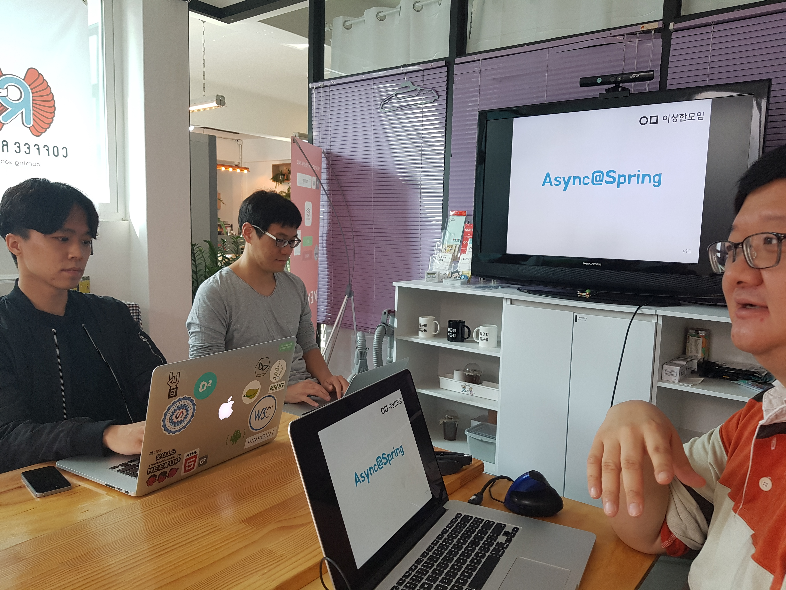
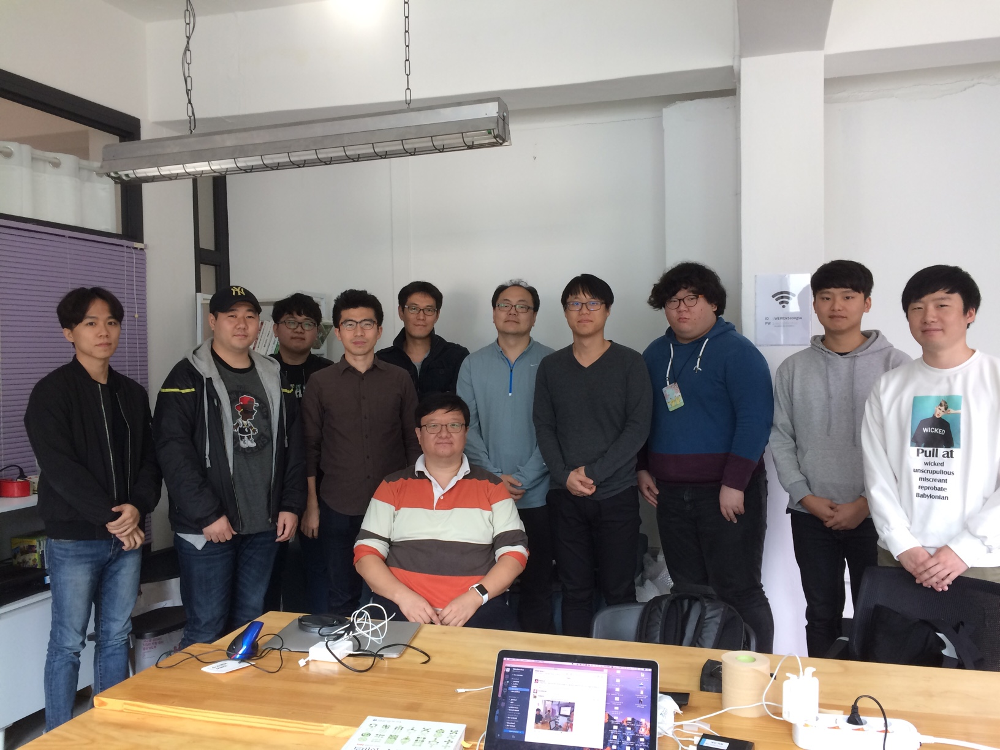

# aync-spring

- Toby Lee님 세미나
- 2016년 10월 15일(토) 10:00 ~ 13:00 / 성수동 커피라디오 아지트
- [강의자료 링크]()

 

## 비동기, 논블록킹

> 이제까지의 스프링은 동기 방식의 개발

관계에 놓인 두 개가 있을 때 같이 가면 동기, 아니면 비동기. 프로그래밍에서는 클라이언트/서비스 사이의 관계로 생각하면 편함. 하나의 쌍에서 호출/응답 (예 HTTP).

- 블록킹
  - 요청한 작업을 마칠때까지 대기 (리턴X)
  - 커넥션 하나당 쓰레드 하나 보장
- 논블록킹
  - 요청한 작업을 즉시 마칠 수 없으면 그냥 리턴
  - 커넥션 여러개 쓰레드 하나 - 논블록킹 (병렬을 아니지만 동시성을 가짐)
- 주로 IO 읽기, 쓰기 메소드 호출

- 둘다 가짐 (예 `Selector.select()`)

### 오해

- 블록킹 = 동기 (X)
- 논블록킹 = 비동기 (X)

### 가능조합

- 동기블록킹
- 동기논블록킹
- 비동기논블록킹
- 비동기블록킹(?) - 완전히 잘못 된 구현

### 비동기 요청 처리 결과 전달 방법

- 콜백
- Future<V>

## Spring @Async

- 쉽고 간편한 비동기 작업 수행 (AOP)
- DI 기반으로 세밀한 제어 가능

### void

- 리턴 값으로 비동기 작업 진행상황이나 결과를 전달하지 않음
- 별도의 방법으로 결과 조회

### ListenableFuture

- Future<V> 를 상속한 인터페이스
- 결과를 받기 위해 블록킹 해야 하는 `get()` 에서 해방
- 성공과 실패 콜백을 구분

## Async Servlet, Async MVC

### 서블릿3.0

- `HTTP Connection`은 이미 논블록킹 IO
- 서블릿 요청 읽기, 응답 쓰기는 블록킹
- 비동기 작업 시작 즉시 서블릿 쓰레드 반납
- 비동기 작업이 완료되면 서블릿 쓰레드 재할당
- 비동기 서블릿 컨텍스트 이용

### 서블릿3.1

쓰레드는 비싼 자원. 이런 낭비를 줄이자. (Thread Pool Hell 방지)

- 논블록킹 서블릿 요청,응답 처리
- 콜백

## HTTP Streaming

한방에 Response 하지 않고 body 를 Streaming.

- ResponseBodyEmitter
- SSeEmitter (Server-Sent Events)
- StreamingResponseBody

## AsyncRestTemplate

스프링의 비동기 HTTP 클라이언트 (Spring 4.0+)

## Callback Hell

대처방법

- 람다식
- 각 단계의 작업을 메소드로 분리
- CompletableFuture

### CompletableFuture

최신 자바 비동기 기술 (자바 8+)

- 명시적 작업완료: `complete()`,  `get()`, `join()`
- 명시적 작업실패: `completeExceptionally()`

## Reactive Spring

> Reactive: 어떤 데이터의 비동기적인 흐름으로 전체 시스템을 만들자

- 추상화된 방식으로 간결하고 강력해진 비동기 프로그래밍
- 마이크로서비스 구조에 최적화
- 클라이언트-서버-백엔드를 연결하는 리액티브 아키텍쳐

### 잘 알아야 잘 쓴다